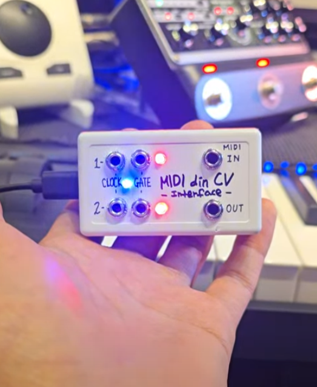

I'm not a programmer, but I built this with help from AI. I'm sharing this in the hopes it might be helpful to someone.  
  
I built this to synchronize the clock between an external analog synth and a DAW.   
By default, MIDI clock is linked to Din MIDI, and most MIDI functions can be communicated via Din MIDI. Channel 16 is used for CV control.  
  
To use CV, create a MIDI track in your DAW and set the output to channel 16.   
There are two channels : Channel 1: C1 note is the clock, C2 note is the gate. Channel 2: D1 note is the clock, D2 note is the gate.  
  
Required components:  
Arduino Pro Micro (ATmega32U4)  
LEDs and resistors  
For DIN MIDI input: 6N138 or 6N139, 1N4148, 220, 4.7kΩ  
3.5mm female connector (CV: mono x 4, DIN: stereo x 2)  
  
[Solder]  
const int gatePin1 = 5; // Channel 1 gate pin (D1)  
const int clockPin1 = 6; // Channel 1 clock pin (C1)  
const int gatePin2 = 7; // Channel 2 gate pin (D2)  
const int clockPin2 = 8; // Channel 2 clock pin (C2)  
  
const int clockLedPin = 18; // Clock LED pin  
const int gateLedPin = 19; // Channel 1 gate LED pin  
const int gateLedPin2 = 20; // Channel 2 gate LED pin  
  
DIN Midi out : TX  
DIN Midi in : RX (see attached image)  
  
https://youtube.com/shorts/l_eDTBdDu1A  
##   

If you're using multiple Arduinos of the same model, you'll need to use different hardware codes.  

Example:  
C:\Users\Administrator\AppData\Local\Arduino15\packages\arduino\hardware\avr\1.8.6  
  
board txt  
micro.build.mcu=atmega32u4  
micro.build.f_cpu=16000000L  
micro.build.vid=0x2341  
micro.build.pid=0x8038 <- (correction)  
micro.build.usb_product="ASW_MC-422s"  
micro.build.board=AVR_MICRO  
micro.build.core=arduino  
micro.build.variant=micro  
micro.build.extra_flags={build.usb_flags}  
  
C:\Users\Administrator\AppData\Local\Arduino15\packages\arduino\hardware\avr\1.8.6\cores\arduino  
  
USBDesc.h  
#define USB_PRODUCT_NAME "ASW_MC-422s"  
#define USB_DEVICE_SERIAL "ASW001"  
  
usbcore.cpp  
#define USB_MANUFACTURER "Ash Sound Works"  
#define USB_PRODUCT "ASW_MC-422s"  
